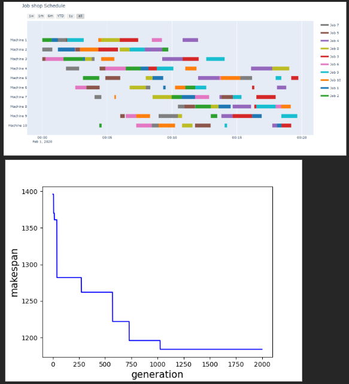

# Solbing Job Shop Schevuling Problem with Genetic Algorithm

## Summary
This report includes the review of the article titled "Opposition Based Genetic Optimization Algorithm with Cauchy Mutation" and the testing of its applications on the solution of the job shop scheduling problem.

The genetic algorithm discussed in the article is an opposition-based genetic optimization algorithm. The main purpose of this algorithm is to solve complex optimization problems such as the job shop scheduling problem by using genetic crossover and mutation operators. In addition, the Cauchy mutation operator is used to increase the genetic diversity of individuals and prevent the algorithm from getting stuck in local minima.

The report focuses on the experimental studies carried out to test the effectiveness of the methods in the article. The performance of the algorithm is examined on various examples for the job shop scheduling problem and the obtained results are evaluated. The analyses show that the proposed genetic algorithm, when combined with Cauchy mutation, has the potential to achieve an effective solution to the job shop scheduling problem.

## Introduction

Job Shop Scheduling Problem represents a type of production planning problem in which jobs and machines in a manufacturing environment must be arranged in a certain order. The main goal is to optimize jobs under certain constraints. This problem is often used to model situations encountered in the manufacturing industry where a series of tasks that need to be processed on various machines must be planned in a certain order.

The basic elements of the job shop scheduling problem are as follows:

Jobs: Tasks or work pieces that need to be completed within a certain time.

Machines: Represents the machines that will be used to complete the jobs.

Operations: Each job contains one or more operations. Each operation is performed on a machine in a certain time.

Operation Sequence: The order in which each job will be processed on the machines.

The main goal is to properly sequence the jobs and operations to minimize the completion time of the jobs or optimize them according to a certain constraint. This optimization usually aims to minimize the total job completion time or to obtain the best solution under a certain constraint (e.g., machine utilization, time constraints).

The job shop scheduling problem is considered a combinatorial optimization problem and can be challenging to solve because there are many possible ordering combinations and evaluating these combinations is a complex process. Heuristic optimization methods such as genetic algorithms can be used to solve such problems.

Various approaches are used to solve complex and combinatorial optimization problems such as the job shop scheduling problem. Here are some of the commonly used methods to solve such problems:

Genetic Algorithms: Genetic algorithms are an optimization technique based on evolutionary computation. Genetic algorithms for the job shop scheduling problem evolve the population by crossover and mutation of the genetic material of individuals. In this way, a population that evolves towards better solutions is obtained.

Simulation-Based Optimization: An approach that models and simulates system dynamics for solving a job shop scheduling problem. In this method, different sorting strategies are evaluated with simulations and the best performing sorting strategy is selected.

Tabu Search: Tabu search is a metaheuristic algorithm that iteratively progresses to various points in a solution space. It explores the solution space using constraints and tabu lists and tries to find the best solution.

Local Search Algorithms: Local search algorithms used for job shop scheduling problems explore the existing solution space in order to improve the initial solution. These algorithms iteratively optimize the existing solutions.

Two-Stage Optimization: This approach includes a phase that first determines the order of the jobs and then a phase that optimizes the machine times according to this order. Two-stage optimization divides the problem into smaller pieces and aims to reach a solution by addressing each piece separately.

Each of these approaches provides different advantages depending on the problem characteristics and requirements. Factors such as the size of the problem, complexity, and available resources play an important role in determining which method will be more effective.

The genetic algorithm method is used in the article and different solutions are presented in addition to traditional genetic algorithms. Different solutions are presented to solve the early convergence problem, which is one of the basic problems of genetic algorithms, and to increase population diversity.

## Method

In the reviewed article, solutions to basic genetic algorithm problems are presented and the methods followed and applied in these genetic algorithm steps are as follows;
 ### Individual Representation

Genetic algorithms are heuristic optimization methods that use the principles of natural selection and genetic variation to optimize problems based on the evolutionary computational approach. One of the basic elements of these algorithms is the "population". A population is a collection of individuals representing potential solutions in a solution space. Permutational representation is a representation that is commonly used for JSSP and is also used in this article.

Permutational population representation is a method in which genetic algorithms represent individuals within a population using a structure that represents permutations of their genetic material. This type of representation is particularly used in situations such as sorting or editing problems. The job shop scheduling problem is an example that requires a permutational population representation.

### Initial Population

The opposition-based approach is a genetic algorithm strategy that uses opposing individuals to create a population. This approach is used to increase the diversity within the population and potentially explore a larger solution space. An opposing individual contains the opposite of each element of the genetic material of a given individual. For example, let's consider a job scheduling problem; if an individual has a job order of [1, 2, 3, 4], the opposing individual will be the opposite of this order, [4, 3, 2, 1].

### Selection Method

The Roulette Wheel Selection Method is a probabilistic selection method used by genetic algorithms to select individuals from a population. This method determines the probability of individuals being selected based on their fitness values ​​and increases the probability of more suitable individuals being selected.

The process involves the following steps:

Calculating Fitness Values: Fitness values ​​are determined for each individual. Fitness value is a metric that measures how well an individual provides a solution to the problem. Generally, individuals with higher fitness values ​​represent better solutions to the problem.

Creating the Probability Distribution: The probability of each individual being selected is directly proportional to the fitness value. Individuals with higher fitness values ​​will have a range with a higher probability of being selected. A wheel that can be thought of as a roulette wheel is created, each slice of this wheel represents an individual, and the sizes of the slices are proportional to the probability of being selected.

Turning the Roulette Wheel: The roulette wheel is turned and stopped at a random stop. This stop determines the individual to be selected.

Adding the Selected Individual to the New Population: The individual stopped on the roulette wheel is added to the newly created population. This process is repeated as much as the population size, thus creating a new population.

The Roulette Wheel Selection Method can accelerate the convergence of the genetic algorithm and increase diversity because it gives individuals with better fitness values ​​a higher probability of being selected. However, in cases of large differences in fitness values, the probability of selection of more popular individuals may be very high, which may affect the convergence.

### Crossover

Two-Point Crossover is a method used by genetic algorithms to cross individuals within a population. This crossover operator is based on the creation of child individuals by cutting at two specific points between two parent individuals. The process includes the following steps:

Selection of Two Parent Individuals: The individuals desired to be crossed are selected from the population using the roulette wheel method as the selection method mentioned above for the crossover process.

Determination of Crossover Points: Crossover points are determined between two parent individuals. These points indicate the places to be crossed on the genetic material of the individuals. In Two-Point Crossover, two randomly selected points are usually used.

Creation of Child Individuals: The genetic material between the two selected crossover points is exchanged between the two parents. This exchange process means that a certain region between the two parents is exchanged with each other. Thus, two child individuals are created.

### Mutation

Cauchy Mutation is a mutation method used by genetic algorithms to mutate individuals within a population. This method is based on randomly changing the genetic material of individuals according to a certain distribution principle. Cauchy distribution can generally be adapted to various optimization problems within genetic algorithms and is especially used for diversity increase purposes.

Certain parameters must be selected for Cauchy mutation. One of the most important parameters is the scale parameter, which controls the width of the Cauchy distribution. This parameter determines the effect of mutation on the genetic material. The genetic material of the selected individual is randomly changed using the Cauchy distribution.

Cauchy mutation can increase the ability of genetic algorithms to break out of local minima and help them search a wider solution space by increasing the diversity within the population. This allows genetic algorithms to adopt a more exploratory and global search strategy.

### Cost calculation

For the calculation of cost, it is calculated by adding the individual's rankings created by reading from a matrix containing the completion times of the machines for each job defined for the FT10 problem.

## Conclusion

In this study, a comprehensive research and application has been carried out on the methods of the article titled "Opposition Based Genetic Optimization Algorithm with Cauchy Mutation". The genetic algorithm proposed to solve job shop scheduling problems uses the opposition based approach in the creation of the initial population, two-point crossover in crossover, and Cauchy mutation in mutation.

At the beginning of the study, the applicability and effect of genetic algorithms on job shop scheduling problems were examined in the literature, then a detailed explanation of the methods proposed by the article was made. Then, these methods were coded in the Python programming language and tested on different problem examples.

The experiments conducted showed that the opposition based approach was effective in diversifying the initial population and Cauchy mutation in increasing the diversity in the solution space. Two-point crossover gave successful results as the crossover operator of the genetic algorithm and contributed to the more effective replacement of the genetic material in the solution space.

This study provides valuable information on the diversity of the initial population, the effectiveness of crossover and mutation operators, which are important in the application of genetic algorithms to job shop scheduling problems. However, further research is required to determine the optimal parameter values ​​for each problem and to generalize to a wider class of problems.

In conclusion, this study demonstrates the usability of genetic algorithms as an effective optimization tool on job shop scheduling problems. The obtained results provide a useful reference for researchers and industry experts who want to increase the problem-solving capabilities of genetic algorithms and optimize efficiency in complex manufacturing processes.

## Source
Kumar, K. A., & Dhas, E. R. (2023). Opposition based genetic optimization algorithm with Cauchy mutation for job shop scheduling problem. Materials Today: Proceedings, 72, 3006-3011. 

Liu, S. C., Chen, Z. G., Zhan, Z. H., Jeon, S. W., Kwong, S., & Zhang, J. (2021). Many-objective job-shop scheduling: A multiple populations for multiple objectives-based genetic algorithm approach. IEEE Transactions on Cybernetics. 

http://jobshop.jjvh.nl/instance.php?instance_id=7 

Atay, Y., & Kodaz, H. (2014). Optimization of job shop scheduling problems using modified clonal selection algorithm. Turkish Journal of Electrical Engineering and Computer Sciences, 22(6), 1528-1539. 
